# 2G-3G-4G-5G网络架构的演变

参考文章：[2019-06-07-2G~5G网络架构的演进](https://kkutysllb.cn/2019/06/07/2019-06-07-2G-5G%E7%BD%91%E7%BB%9C%E6%9E%B6%E6%9E%84%E7%9A%84%E6%BC%94%E8%BF%9B/)

移动通信网络架构的演进包括两个方面，即无线接入网（RAN，Radio Access Network）的演进和核心网（CN，Core Network）的演进。

## 1. 2G/3G/4G网络架构的演变

### 1.1 2G->2.5G

**从GSM网络（2G）演进到GPRS网络（2.5G），最主要的变化是引入了分组交换业务。**原有的GSM网络（2G）是基于电路交换技术，不具备支持分组交换业务的功能。因此，为了支持分组业务，在原有GSM 网络结构上增加 了几个功能实体，相当于在原有网络基础上叠加了一个小型网络，共同构成GPRS网络。

> 2G->2.5G：电路交换-> 电路交换+分组交换

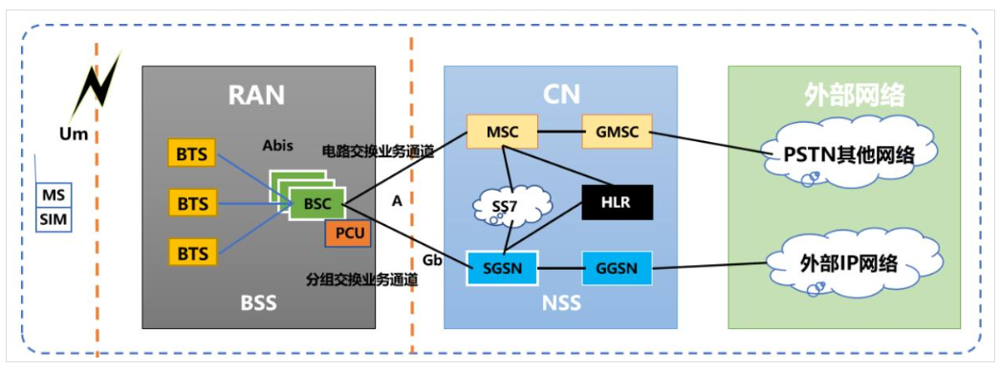

> RAN是接入网，CN是核心网，后面是外部网络

​		在接入网方面，在BSC上增加了分组控制单元（PCU，Packet Control Unit），用以提供分组交换通道；在核心网方面，增加了服务型GPRS支持节点（SGSN，Service GPRS Supported Node）和网关型GPRS支持节点（GGSN，Gateway GPRS Supported Node），功能方面与MSC和GMSC一致，区别在于处理的是分组业务，外部网络接入IP网；从GPRS叠加网络结构开始，引入了两个概念。一个是电路交换域（CS域），一个是分组交换域（PS域）。

### 1.2 3G

到了3G时代，在速率方面有了质的飞跃，而在网络结构上，同样发生巨大变化。首先，就是空中接口的改变，以往网络结构中的**Um接口变成Uu接口**，而接入网和核心网的接口也换成了**Iu接口**，不再是A接口。在接入网方面，不再包含BTS和BSC，取而代之的是**基站NodeB与无线网络控制器（RNC，Radio Network Controller）**，功能方面与以往保持一致，**核心网方面基本与原有网络共用，无太大区别。**

> 3G:  Un接口，接入网和核心网接口变成 Iu接口。

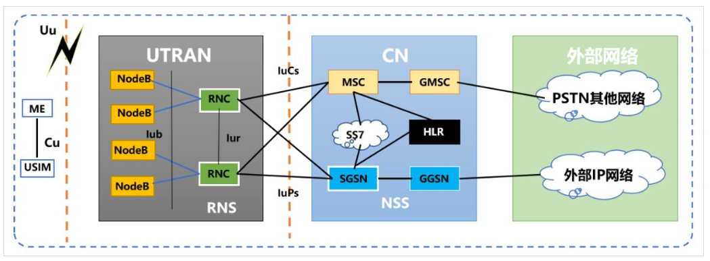

**NodeB的功能：主要完成射频处理和基带处理两大类工作。**射频处理主要包括发送或接收高频无线号，以及高频无线信号和基带信号的相互转换功能；基带处理主要包括信道编/译码、复用/解复用、扩频调制及解扩/解调功能。

**RNC的功能：主要负责控制和协调基站间配合工作**，完成系统接入控制、承载控制、移动性管理、宏分集合并、无线资源管理等控制工作。

### 1.3 4G

到4G时代，整个LTE网络从接 入网和核心网方面分为E-UTRAN和EPC。在接入网方面，网络扁平化，不再包含两种功能实体，**整个网络只有一种基站eNodeB**，它包含整个NodeB和部分RNC的功能，演进过程可以概括为**“少一层，多一口，胖基站”**。这样做降低了**呼叫建立时延**和**用户数据传输时延**，并且随着网络逻辑节点的减少，可以降低建设和维护成本，满足低时延、低复杂度和低成本的求。

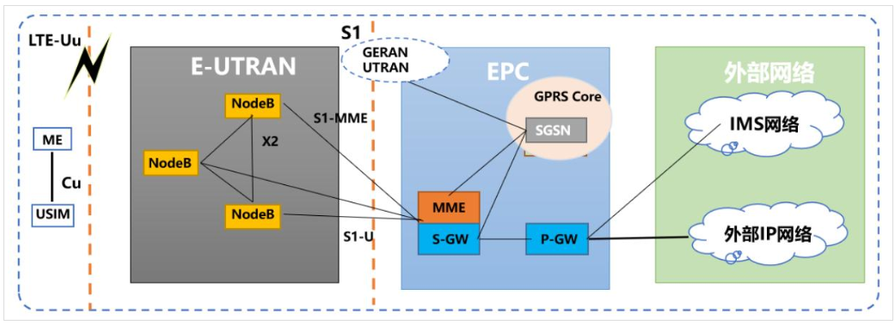

**“少一层”：**4层组网架构变为3层，去掉了RNC，减少了基站和核心网之间信息交互的多节点开销，用户平面时延大大降低，系统复杂性降低。

**“多一口”：**以往无线基站之间是没有连接的，而eNodeB直接通过X2接口有线连接，实现无线侧IP化传输，使基站网元之间可以协调工作。eNodeB互连后，形成类似于“Mesh”的网络，避免某个基站成为孤点，这增强了网络的健壮性。

**“胖基站”：**eNodeB的功能由3G阶段的NodeB、RNC、SGSN、GGSN的部分功能演化而来，新增了系统接入控制、承载控制、移动性管理、无线资源管理、路由选择等。

核心网侧也发生了重大变革。在GPRS/UMTS中，服务GPRS支持节点（SGSN）主要负责鉴权、移动性管理和路由选择，而网关GPRS支持节点（GGSN）负责IP地址分配、数据转发和计费。到了LTE时代，EPC（Evolved Packet Core）对之前的网络结构能够保持前向兼容，但自身结构方面不再有3G时的各种实体部分，主要由移动管理实体（MME，Mobile Management Entity）、服务网关S-GW和分组数据网关（P-GW）构成，外部网络只接入IP网。其中，**MME主要负责移动性管理，包括承载的建立和释放、用户位置更新、鉴权、加密等**，这些笼统地被称为控制面功能，而**S-GW和P-GW更主要的是处理用户面的数据转发，但还保留内容过滤、数据监控与计费、接入控制以及合法监听等控制面功能。**可以看到，从GPRS到EPC的演进中，有着相似的体系架构和接口，并朝着控制与转发分离的趋势演进，但这种分离并不彻底。比如MME相当于SGSN的控制面功能，S-GW则相当于SGSN的用户面。

此外， LTE核心网新增了一个网元**PCRF**（图中未画出），即**策略与计费执行功能单元**，可以实现对用户和业务态服务质量（QoS）进行控制，为用户提供差异化的服务，并且能为用户提供业务流承载资源保障以及流计费策略。

### 1.4 5G

[进一步阅读](https://kkutysllb.cn/2019/05/27/2019-05-27-5G%EF%BC%9A%E7%9C%8B%E8%B5%B7%E6%9D%A5%E5%BE%88%E7%BE%8E%EF%BC%8C%E4%BB%BB%E9%87%8D%E8%80%8C%E9%81%93%E8%BF%9C/)

5G（第五代移动通信）是IMT（国际移动通信）的下一阶段，ITU（国际电信联盟）将其正式命名为IMT-2020。

#### 1.4.1 5G标准

**5G最重要的标准化组织有ITU和3GPP**。

其中，**ITU是联合国负责国际电信事务的专业机构**，其下分为电信标准化部门（ITU-T）、无线电通信部门（ITU-R）和电信发展部门（ITU-D），每个部门下设多个研究组，每个研究组下设多个工作组，**5G的相关标准化工作是在ITU-R WPSD 下进行的**。ITU-R WPSD是专门研究和制订移动通信标准IMT（包括IMT-2000和IMT-Advanced）的组织.

3GPP是一个产业联盟，其目标是根据ITU的相关需求，制订更加详细的技术规范与产业标准，规范产业行为。**3GPP（the 3rd Generation Partnership Project）是领先的3G技术规范机构，是由欧洲的ETSI、日本的ARIB和TTC、韩国的TTA、美国的T1和中国的无线通信组CWTS共6个标准化组织伙伴组成。3GPP的会员包括组织伙伴、市场代表伙伴和个体会员3类。3GPP市场代表伙伴不是官方的标准化组织，它们是向3GPP提供市场建议和统一意见的机构组织。

#### 1.4.2 5G架构设计

5G的架构设计主要需要满足**关键性能需求**和**网络运营需求**。3GPP定义了5G应用的三大场景：**增强移动宽带（**Enhanced Mobile Broadband**，eMBB）**、**海量机器类通信（**Massive Machine Type Communications**，mMTC）**和**超可靠低时延通信（**Ultra-reliable and Low-latency Communications**，uRLLC）**。eMBB 场景是指在现有移动宽带业务场景的基础上， 对于用户体验等性能的进一步提升，主要还是追求人与人之间极致的通信体验。mMTC 和 uRLLC都是物联网的应用场景，但各自侧重点不同。mMTC 主要是人与物之间的信息交互，而 uRLLC 主要体现物与物之间的通信需求。

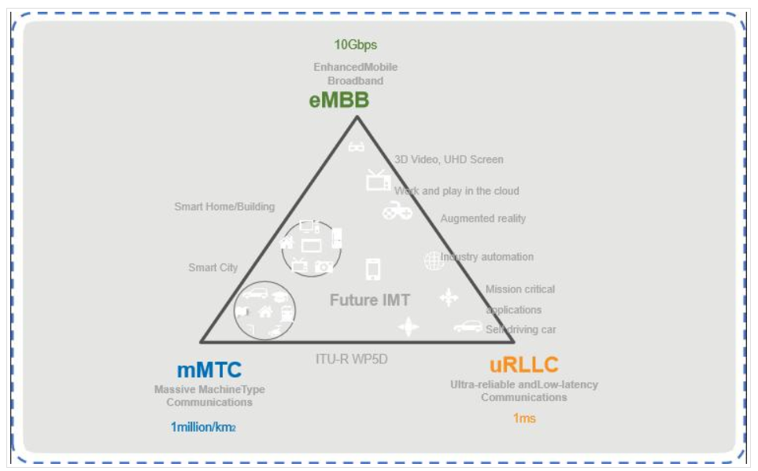

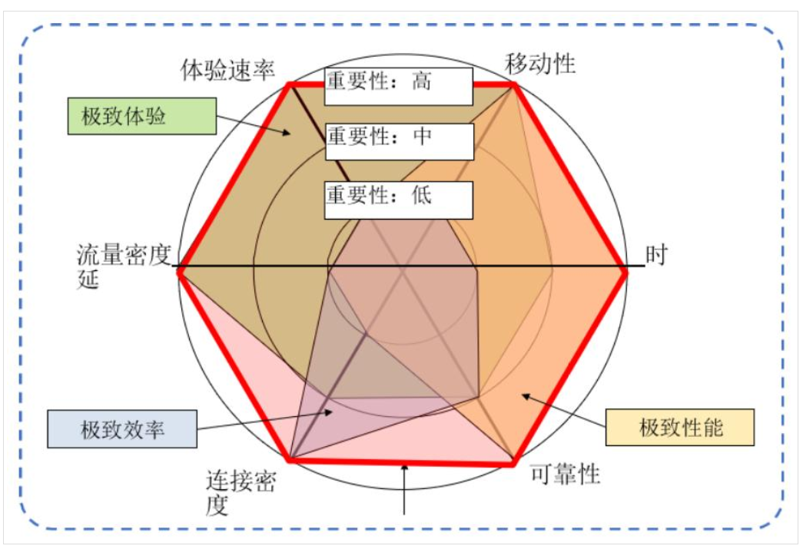

**1）对于eMBB场景，又可进一步细分为连续广覆盖场景**和**热点高容量场景。**在连续广覆盖场景下，要随时随地提供100Mbps ~1Gbps的高体验速率，并支持在高速移动如500km/h过程中的基本服务能力和业务的连续性。在LTE网络结构中，基站间虽然可以通过X2接口实现南北向数据交互，但无线资源管理、移动性管理和站间协同能力较弱。 另外，4G主要是通过核心网实现多种无线接入的统一控制，不同的接入技术在无线侧控制面各异，无法统一，互操作复杂。在热点高容量场景下，核心网网关部署的实际位置较高，且数据转发模式单一，回传网络的容量压力较大。**eMBB 聚焦对带宽有极高需求的业务**，例如高清视频，虚拟现实/增强现实等等，满足人们对于数字化生活的需求。比如：移动的环境中，网联无人机对大带宽、低时延的需求，将会引爆众多高价值创新行业应用。初期可以采用4G拓展应用，后续随着5G引入业务体验更好、创新应用更多。

**2）对于mMTC场景，**当海量的5G差异化的物联网终端接入时，**由于LTE采用的是与移动互联网场景相同的单一移动性和连接管理机制，承载物联网少量数据仍需消耗较大的基于隧道的GTP-C报头开销，** 不仅效率低，还极有可能造成信令拥堵。**mMTC 则覆盖对于联接密度要求较高的场景**，例如智慧城市，智能农业，满足人们对于数字化社会的需求。比如：奠基国家工业互联网，助力中国制造2025，采用授权频率，使用4G/5G及有线网络等技术，基于运营商的泛在网络，为工业互联网工厂内外数据应用提供连接服务，主要包含**采集类、控制类、监测类**等应用。

**3）对于uRLLC场景，现有网络架构的控制面功能逻辑上分布在MME/SAE-GW等多个网元中，**无法实现集中控制，同一网络控制功能可能需要多个网元通过接口协议协商完成，**端到端通信时需经历较长的传输时延，且可能由于某些原因存在路由迂回现象。**这既无法满足5G高可靠性前提下的低时延要求（现网端到端时延与 5G的时延要求约存在两个数量级的差距），又无法满足特定业务如车联网的安全性要求。**uRLLC 聚焦对时延极其敏感的业务**，例如自动驾驶/辅助驾驶，远程控制等，满足人们对于数字化工业的需求。比如：5G技术可满足车联网低时延、高速、高可靠性的业务需求，可以重新定义汽车安全，促使车联网创新应用成为现实。

而网络运营方面的需求主要是运营商在部署新网络时，一般都会考虑建设和运营的可行性，便利性。因此，对5G网络提出了**灵活部署、覆盖与容量兼容、精细化控制、能力开放**和**异构兼容**等需求，这些需求在当前LTE网络只能实现很少一部分。因此， 5G网络架构的设计需要满足**转控分离、集中控制、分布式部署、资源池化**和**服务模块化**等要求。

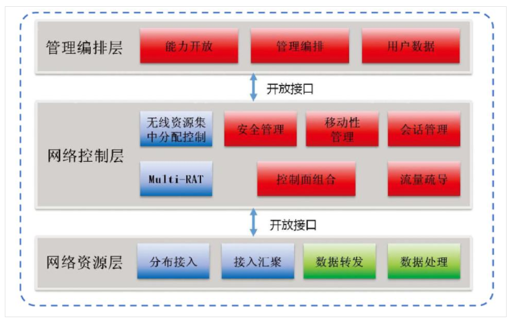

综上，对于5G接入网，要设计一个满足多场景的以用户为中心的多层异构网络，以支持宏微结合，统一容纳多种接入技术，提升小区边缘协同处理效率，提高无线和回传资源利用率。对于5G核心网的设计，一方面要将转发功能进一步简化和下沉，将业务存储和计算能力从网络中心下移至网络边缘，以支持高流量和低时延业务要求，以及灵活均衡的流量负载调度功能；另一方面通过能力开放、资源编排、集中控制等更高效地支持差异化的业务需求。

#### **1.4.3 5G网络架构的提出**

在5G逻辑架构的设计上，业界遵循**先继承、后创新**的思路，参照现有成熟的LTE网络架构，**引入SDN和NFV**等关键技术对网络功能进行解析和重构，以逐步适应5G架构的演进需要。

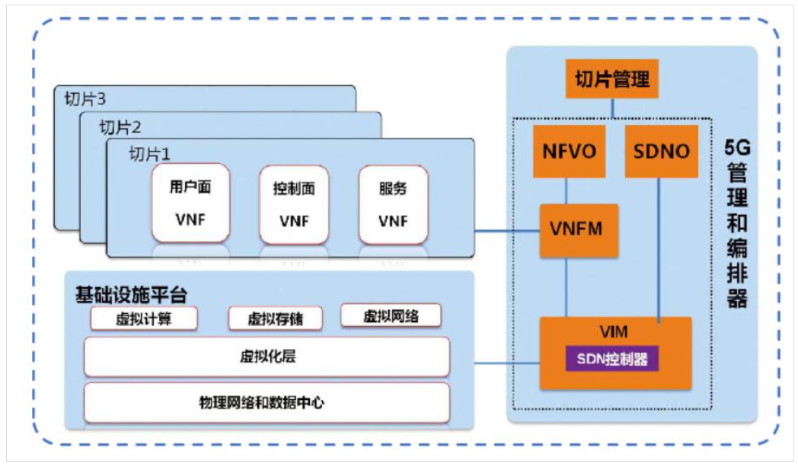

为了便于大家理解，我们从LTE的网络结构分析入手，逐步引出5G的网络逻辑架构演进思路。我们将LTE非漫游网络架构从逻辑上划分为3个部分，如下图所示。 第1部分是LTE为了满足网络的后向兼容性所引入的，在此不做赘述。第2部分是接入网，接入网（空口）的演进几乎是历代移动通信网络架构演进中最为关键的部分。第3部分是**核心网**，是一个并不彻底的转控分离架构，且是5G时代优先需要重构的重点。因此，我们优先聚焦该部分的重构。

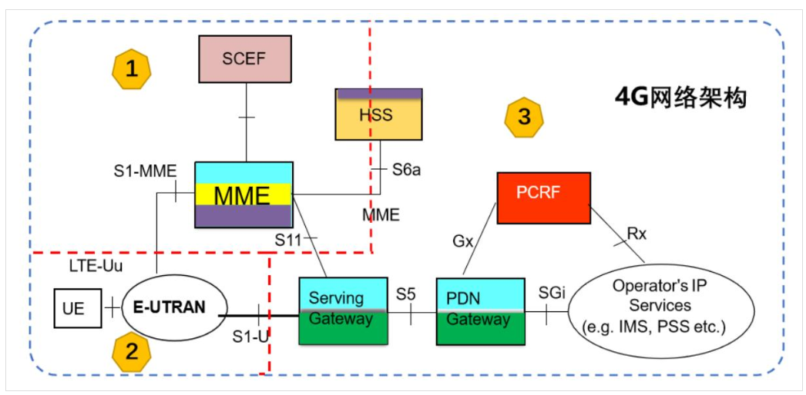

**Step1：**为了解决控制与转发分离不彻底的问题，需要首先对兼具控制和转发功能的网关进行解耦。LTE架构中S-GW和P-GW实际上是物理网元功能合一的，在逻辑上我们可以将其视为统一的SAE-GW，然后引入SDN技术进行网络功能解耦，**用户面功能由新定义的网元UPF承载**，**控制面功能则交由新网元SMF进行统一管理**。相应地，将原本已是纯控制面网元的**MME、HSS和PCRF分别定义为AMF、UDM和PCF**，但对网元的实际功能只做微小的变更或整合。核心网第一步重构后的网络逻辑架构如下图所示。

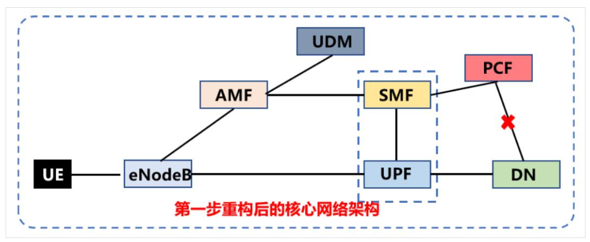

**Step2：**为了满足网络资源充分灵活共享的需求，实现基于实际业务需求的网络自动部署、弹性伸缩、故障隔离和自愈等，需要引入NFV对网络功能进行虚拟化。因此，我们**定义新网元NF以适应新的需要。考虑到NF面向的是用户差异化的服务，我们将其置于网元PCF，并定义新的接口以便NF能够按需获取PCF的策略控制等参数。**核心网第二步重构后的网络逻辑架构如下图所示。

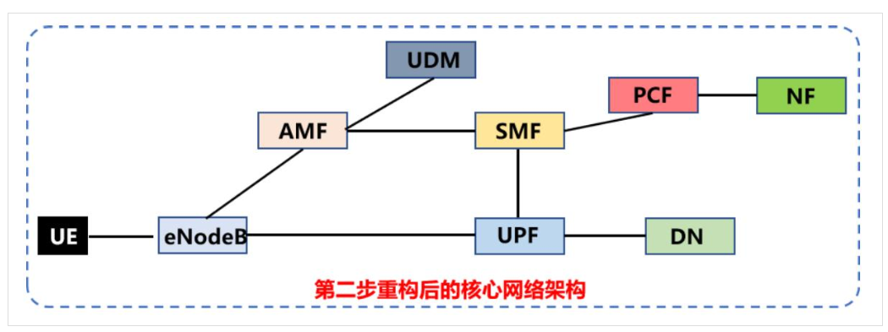

**Step3：需要将业务平台下沉到网络边缘，为用户就近提供业务计算和数据缓存能力，实现网络从接入管道向信息化服务使能平台的关键跨越。**因此，需要**增强UDM的功能，以承担业务平台下沉后相应的数据管理工作。**同时，**引入网元AUSF承担数据访问的鉴权和授权工作。**此外，考虑到5G面向的是极端差异化的业务场景，传统的“竖井式”单一网络体系架构无法满足多种业务的不同QoS保障需求，还需**引入网元NSSF以实现网络切片选择的功能**，使网络本身具备弹性和灵活扩展的能力。核心网第三步重构后的网路逻辑架构如下图所示。

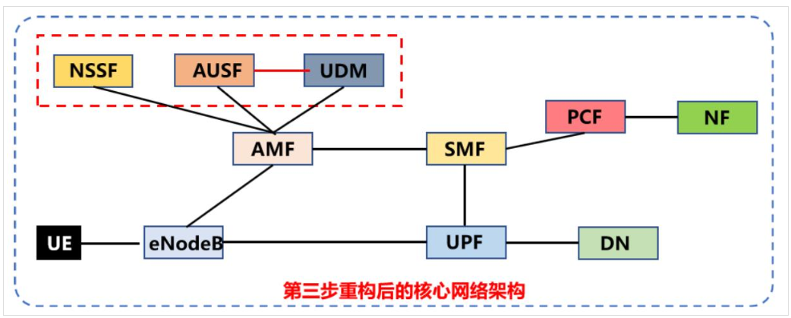

**Step4：接入网侧的网元编排。**从1G到4G，无线通信系统经历了迅猛的发展，现实网络逐步形成了包含多种无线制式、频谱利用和覆盖范围的复杂现状。在5G时代，同一运营商将面临多张不同制式网络长期共存的局面。因此，多网络融合也将成为5G网络架构设计不可规避的因素。对此，需要改变原有网络单一的eNodeB接入形式，对接入网侧做进一步的优化和增强。**需要重新定义新的网元为（R）AN，以表示接入侧不再是单一的无线接入，而是固移融合。**第四步重构后的网络逻辑架构图如下图所示。

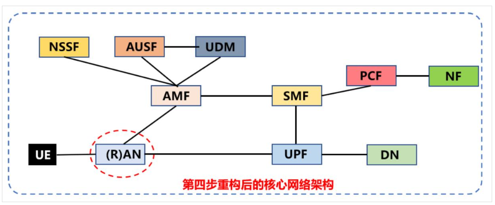

**Step5：**完成各个网元之间逻辑接口的定义，终端UE与AMF实体之间的**N1接口**是新定义的空口，使得低时延、高可靠、超密连接等愿景具备落地的可能。同时，原来的NF被定义为运营商授信、自行部署的**应用功能单元AF**。

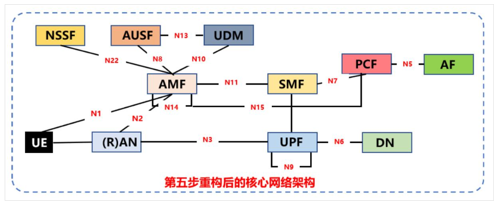

通过五步重构，我们就得到了3GPP所确定的5G网络架构，这是一个点到点网络架构，主要包含以下网元功能：

**AMF：接入和移动性管理功能单元，负责控制面的注册和连接管理、移动性管理、信令合法监听以及上下文的安全性管理。**相比4G的MME，AMF将**漫游控制、承载管理**以及**网关选择**等功能剥离，是一个“瘦身版”的MME。

**SMF：会话管理功能单元，相当于是4G的MME和SAE-GW控制面整合后集中控制单元，主要负责会话管理，包括会话建立、变更和释放，以及AN节点和UPF间的承载维持。**SMF同时也继承了4G MME的**漫游控制功能、UPF选择和控制功能**和P-GW的**UE-IP地址分配功能。**

**UPF：数据转发功能单元，保留了4G SAE-GW的数据转发功能，包括本地移动性锚点、包路由和转发、上下行传输级包标记、包过滤和用户面策略控制功能执行，**相当于SDN架构中纯转发面，无自主控制权，只能执行来自SMF的控制指令。

**PCF：策略控制功能单元，负责制定统一的策略框架来管理网络行为。一方面结合自定义信息作出决策并强制控制面执行，另一方面也为前端提供连接用户数据库获取用户订阅信息的渠道。**PCF与4G的PCRF功能几乎相同。

**UDM：统一数据管理单元，类似4G的HSS分为FE和BE两个功能实体，UDM同样也包含两个功能实体UDM和UDR。**UDM类似FE属于应用前端接口单元，负责鉴权、授权、位置管理和订阅管理。UDR类似BE属于用户数据库单元，负责用户数据的存储、包括订阅表示、安全认证、移动性数据、会话数据等。与HSS相比，是一个增强版的HSS。

**AUSF：认证服务器功能单元，负责业务层面的认证和授权，相当于将4G时代业务服务器AS中对访问进行鉴权和授权的功能单独剥离出来。**作为网络准入的裁决者，AUSF联合UDM对通过AMF来访的UE进行准入授权，认证通过的UE可以凭借AUSF授权的专用秘钥token实现数据的访问和获取。

**NSSF：网络切片选择功能单元，主要根据网络配置，为合法的UE选择可提供特定服务的网络切片示例。**其机制是通过切片需求辅助信息的匹配，为UE选择一个或一组特定的AMF提供网络服务。需要注意一点，**NSSF只是完成核心网层面的切片选择，至于端到端的切片建立，是通过NSSF选择的AMF来实现接入网切片的确认。**

**AF：应用功能单元，通过与核心网交互对外提供专用服务。**AF是运营商自行部署的授信的应用，可以直接访问网络的相关应用功能，**无需经过其它外部接口**

为契合IMT-2020推进组提出的“三朵云”5G网络架构，我们将上述重构后的网络架构进行平面的切割，如下图所示。

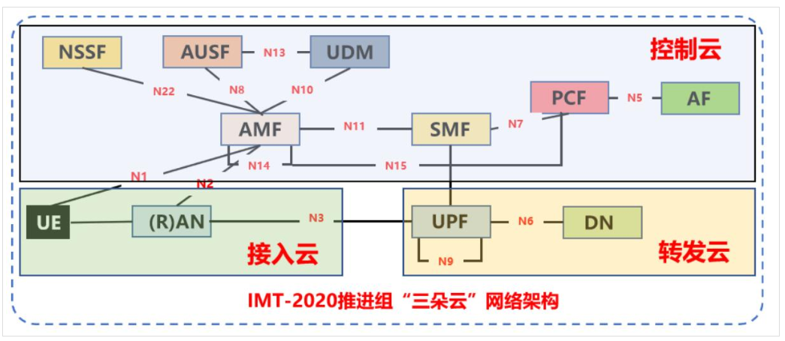

**“三朵云” 5G网络是一个可依业务场景灵活部署的融合网络。** **控制云**完成全局的策略控制、会话管理、移动性管理、策略管理、信息管理等，并支持面向业务的网络能力开放，实现定制网络与服务， 满足不同新业务的差异化需求，扩展新的网络服务能力。**接入云**将支持用户在多种应用场景和业务需求下的智能无线接入，并实现多种无线接入技术的高效融合，无线组网可基于不同部署条件要求，进行灵活组网，并提供边缘计算能力。**转发云**配合接入云和控制云，实现业务汇聚转发功能，基于不同新业务的带宽和时延等需求，转发云在控制云的路径管理与资源调度下，实现eMBB、uRLLC和mMTC等不同业务数据流的高效转发与传输，保证业务端到端质量要求。“三朵云” 不可分割，协同配合，并且是基于SDN/NFV技术实现。