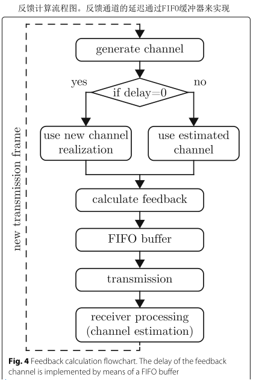

# Vienna 5G Link Level Simulator

原文 Versatile mobile communications
simulation: the Vienna 5G Link Level Simulator

---

摘要：移动通信系统的研究和开发需要对新技术进行详细的分析和评估，以进一步提高频谱效率、连通性和可靠性。由于对移动宽带数据速率的需求呈指数级增长，以及对时延和可靠性的苛刻要求，移动通信规范变得越来越复杂。因此，链路级方法的分析分析以及基于测量的调查很快就会遇到可行性限制。因此，计算机辅助数值仿真是研究无线通信标准的重要工具，对未来技术的分析和发展是不可或缺的。在这篇文章中，我们介绍了维也纳5G链路级仿真器，这是一个基于MATLAB的链路级仿真工具，可促进移动通信的研究和开发。我们的模拟器支持符合4G 
LTE、5G NR甚至更高标准的设置，使其成为非常灵活的模拟工具。它在学术使用许可下免费提供给其他研究人员，极大地提高了无线通信研究的重复性。

关键字：Mobile communications, 5G, New radio, Link-level simulation

---

## 1. 引言

链路级测量、分析和仿真是开发新型无线通信系统的基本工具，每个工具都有其独特的优点。测量为信道建模提供基础，并提供任何收发器架构的最终性能基准，因此是分析和仿真的前提。然而，执行测量非常昂贵、耗时并且很难适应特定的通信场景。分析研究的一大优势是它们有可能揭示系统的关键参数之间的关系。然而，分析的可操作性通常需要应用限制性的假设和简化，从而限制了分析结果在现实条件下的价值。为了研究高度复杂的系统，如无线收发信机，并有效地评估新技术的性能，因此经常进行链路级仿真是首选的方法。它使现实和实际约束的结合成为可能，在许多情况下，这些约束极大地改变了纯分析性调查所描绘的图景。然而，只有通过测量、分析和模拟的互补，才有可能获得所有这三种方法的好处。

​		在本文中，我们将介绍我们的维也纳蜂窝通信仿真器（ Vienna Cellular Communications Simulators，VCCS）套件的新成员，维也纳5G链路级（Vienna 5G link level，Vienna 5G LL）仿真器。我们位于TUWien的电信研究所的移动通信研究小组在学术使用许可下开发和共享符合标准的蜂窝通信模拟器有着悠久而成功的历史。由此，我们提高了无线通信学术研究的可重复性[1,2]。维也纳LTE仿真器[3]的实施始于2009年，引领三个可靠的标准兼容LTE仿真器：下行链路系统级仿真器[4,5]和两个链路级仿真器，一个用于上行链路[6]和一个用于下行链路 [7]。尽管第三代合作伙伴计划（3GPP）朝向5G的路径主要基于长期演进（LTE），但是由于在实现和功能方面缺乏仿真平台的灵活性，因此将我们的LTE仿真器向5G演进并不是直截了当的。与4G相比，5G内的移动通信预计将支持更多异构和易用的用例，例如增强型移动宽带（enhanced mobile broadband, eMBB），大规模机器类型通信（massive machinetype communication, mMTC或超可靠和低延迟通信（ultra-reliable and low-latency communication, uRLLC） 。此外，在5G内引入了大量新颖的概念，例如全维/大规模多输入多输出（MIMO）波束成形[8-10]，混合数字多载波传输[11,12]，非正交多址接入[13,14]，毫米波（mmWave）[15,16]传输等，都需要更详细分析。因此，我们决定扩展我们的VCCS仿真器，演进到具专用5G链路和系统级仿真器的下一代移动通信。

​		Vienna-5G-LL仿真器侧重于通信系统的物理层（PHY）。相应地，范围是发送器-接收器链（信道编码，MIMO处理，多载波调制，信道估计，均衡）的点对点仿真，支持多样的仿真参数。在我们的LL模拟器中，没有使用用于通过无线信道传输比特的抽象模块。相反，整个发射器和接收器链以及无线信道上的信号传输都是针对各个信号样本实现的，因此可以提供非常高的细节和准确度。尽管如此，仍然可以仿真包含少量发射和接收机的多点通信（仅受计算复杂性限制）如多点预编码技术[17]，速率分裂方法[18]或干扰对齐概念[19]。 

​		仿真器允许（和包括）参数设置，这些参数设置可以用于标准兼容系统，包括LTE和5G。它进一步提供了参数化任何基于正交频分复用（OFDM）的无线系统（例如WiMAX，IEEE 802.11a / p等）的可能性，并仿真它们的共存。然而，仿真器的多功能性提供了远远超出标准的复杂仿真能力，例如，能够用于评估PHY设置的各种组合以及研究各种候选5G技术的共存。仿真器在Matlab中使用面向对象的编程方法实现，其源代码可以在学术使用许可下下载[2]。维也纳5G-LL模拟器与维也纳5G系统级（Simulaiton Level, SL）仿真器可以密切配合：LL用于确定SL上使用的PHY抽象模型，从而实现计算高效的大规模移动网络的仿真。

​		这项贡献的目标是向研究界介绍维也纳5G LL模拟器，并在学术使用许可下免费提供这一多功能和灵活的模拟工具，以提高研究的重现性。为了阐明我们的科学贡献，我们在第二节中将我们的新模拟器与其他现有的仿真工具进行了比较。此外，我们还在第二节中指出了与未来移动通信系统相关的具体用例和场景。第三节描述了模拟器的总体结构，第四节详细说明了它的实现特性。第五节讨论并展示了前面提到的示范用例的使用情况。

## 2.  科学贡献

### 2.1相关工作-现有仿真工具

### 2.2 Vienna-5G-LL模拟器的科学贡献和新颖性

目前从LTE到5G的演进表明，LL仿真仍然是一个非常活跃的研究课题，因为需要对许多不同的候选RAN和PHY方案进行测量并相互比较。 Vienna-5G-LL仿真器支持这些需求，并且由于其多功能性，能够用来对未来的PHY技术进行评估。仿真器允许自由选择几乎所有PHY参数，以便可以仿真任何多载波系统; 具体地，根据标准规范设置参数，可以针对LTE或5G进行与标准兼容的仿真（我们在仿真器软件包中提供相应的参数文件）。 由于面向对象编程的模块化结构和应用，可以很容易增加新的功能，例如附加信道模型等。

​		为了验证我们的仿真工具，我们与维也纳LTE-A下行链路LL仿真器进行了比较。 由于维也纳LTE-A下行链路LL仿真器是一个成熟的工具，已经通过[1]中描述的测量验证，我们将其视为参考。比较显示两个仿真工具之间非常匹配。
    

​		我们的LL仿真器用于高度详细地仿真PHY。 它考虑了在单个的样本粒度中通过仿真无线信道的时间信号的实际传输。 这使得对于当前以及未来移动通信系统的PHY方案的详细分析成为可能，例如，研究信道延迟和多普勒扩展对各种PHY波形的影响等。下面是我们的5G-LL平台所具有的特性：

超越5G的PHY方法：如上所述，仿真器通过实现[31,32]中描述的信号处理链，支持符合标准的LTE/5G物理下行链路共享信道以及物理上行链路共享信道的仿真。 然而，自适应调制和编码（adaptive modulation and coding, AMC），MIMO处理和基带多载波波形的仿真参数不限于标准。 此外，模块化的仿真器结构可以很允许容易地集成新功能来研究未来移动通信系统的候选技术，例如增加波形或调制和编码方案（ modulation and coding
schemes, MCSs）。作为示例，我们已经实现了FBMC传输，用来与在5G标准化中采用的基于OFDM的滤波/加窗波形，以及通用滤波多载波（UFMC），滤波OFDM（f-OFDM）等进行比较。

灵活的numerology（参数集？）：正如3GPP针对5G所介绍的，灵活的numerology概念描述了适应资源元素的时间和频率跨度的可能性。这意味着子载波间隔和多载波波形的符号持续时间能够适应各种服务需求（延迟、覆盖、吞吐量）、信道条件（延迟或多普勒扩展）和载波频率。由于这些参数在我们的仿真器中可以自由调整，因此可以研究不同参数的影响，甚至超出标准范围[32]。综上所述，仿真器能够在任意信道条件下，结合各种信道码（见第4.1节），在延迟和多普勒扩展方面对多载波波形（见第4.2节）的数值进行比较和优化。

多链路仿真：Vienna-5G-LL仿真器能够仿真多个用户和基站（仅受计算复杂性限制）。虽然分析具有大量用户和基站的大型网络并不是链路级仿真的目标，但该特性允许对IUI展开研究。由于采用了具有固定参数的OFDM，单元内的用户信号自动正交，因而LTE的LL不需要此功能。但在5G环境中，用户则不再正交。因此需要能够在链路级仿真多个用户以及基站。

## 3. 仿真结构

在这一部分中，我们将简要介绍维也纳5G 
LL模拟器，并简要介绍该模拟器的结构。我们的仿真器的总体结构类似于任何其他链路级仿真器，例如参见[1]中的图1、2、3或[22]中的图2、3、4。尽管如此，由于我们的实现是全新的、模块化的，因此非常灵活，因此我们简要介绍了我们的具体实现。除此概述外，我们的专用模拟器网页[2]上还提供了补充文档，如用户手册以及详细的功能列表。

​		在大多数情况下，链路级仿真假设发送和接收机之间的传输链路具有固定的**信噪比（signal-to-noise ratio, SNR）**。我们在仿真器中稍微偏离了这种常见方法，因为我们**支持多种不同的波形**，这些波形在给定的总发射功率下实现不同的SNR。因此，我们不是固定SNR，而是固定发射和噪声功率，并将SNR确定为所采用波形的函数。此外，由于我们支持多链路传输，我们为这些链路引入了单独的路径损耗参数，以便能够控制各个连接的SIR。但是，与SL仿真器相比，我们不会引入空间网络几何来确定路径损耗，而是将路径损耗设置为仿真器的输入参数。 *LL仿真的目标是获得PHY性能指标的结果*，例如吞吐量，误码率（bit error ratio, BER）或帧错误率（frame error
ratio, FER），它们代表了指定场景内的平均系统性能。为此，进行蒙特卡罗仿真，并在一定数量的信道，噪声和数据实现上对结果进行平均。为了衡量所得结果的统计显著性，仿真器计算相应的95%置信区间（默认值）。

​		图1说明了仿真器采用的基本处理和仿真步骤。 第一步是为仿真器指定和提供场景文件。文件中包含仿真所需所有信息。设定场景从指定网络拓扑开始，即定义网络中的所有节点及其相关链接。 节点或者是BS或者为用户。 仿真器能够支持在这些节点之间进行任意的网状连接。这些连接可以用作下行链路、上行链路或旁链路(设备到设备链路)。此外，小区间和小区内干扰很容易捕获，因为它只需要在假定的干扰节点之间建立相应的连接。 它是仿真器的最基本模块，包含所有PHY功能对象，例如信道编码，调制，MIMO处理，信道生成和估计以及信道状态信息（CSI）反馈计算等。 此外，链接对象还包含在特定连接的整个收发器链中生成的信号。

​		对于用于仿真的BS或用户的数量没有限制。仿真无线网络的大小仅受仿真复杂度的限制。考虑到链路对象内对计算能力要求最高的部分是信道编码和解码，仿真复杂度随着两个节点之间的链路数量线性增加。

​		指定网络拓扑后，场景设置中的下一步是输入传输参数。 这涵盖了整个传输链，包括采用的信道编码方案，多载波波形，信道模型，以及接收机使用的均衡器和解码器。如果所有链接和节点使用相同的设置，则可以为每个链路和节点本地设置参数，或者方便地全局设置参数。 为不同的链接设置不同的参数可以实现多种技术的共存研究。 例如，可以将一个小区设置为OFDM和Turbo编码，而另一个小区使用具有低密度奇偶校验（LDPC）编码的FBMC。请注意，由于信号是基于样本处理的，因此这种干扰的建模非常准确。

​      场景文件准备好之后，将由仿真器的主脚本加载，这里仿真将根据输入的拓扑和参数进行设置。 在指定的扫描参数（例如路径损耗，发射功率或速度）上逐帧地执行仿真。 请注意，速度仅决定用户频道的最大多普勒频移; 由于LL仿真器中没有几何体，因此用户没有随时间变化的物理位置。

​      在仿真中，仿真器执行所有制定传输链路中的完整的上行以及下行操作，包括激活LTE兼容的CSI反馈、AMC等自适应链路，以及符合标准的MIMO处理等（参见第4.4节）。所有节点吞吐量、FER和BER等随扫描参数（例如，SNR）等的关系被作为仿真器的输出。除了这些聚合结果之外，仿真器还存储各个帧的仿真结果，以支持研究人员进行后期处理。 整个过程以这样的方式进行优化：仿真期间交换的信息的开销很小，并且操作被有效地执行。 此外，可以在扫描参数的循环上进行并行处理，这在多处理器机器上运行时大大减少了仿真时间。

## 4、仿真器特性

在本节中，我们将更详细地介绍维也纳5G 
LL模拟器。文中描述了主要组件和功能，让您深入了解可用的多功能功能。为了突出使我们的LL模拟器独一无二的功能，我们将在第5节进一步提供和讨论示范模拟的结果。所有这些示例场景都包含在模拟器下载包中，并且易于重现。

### 4.1 信道编码

​		传输链中第一个处理模块是向发送信号提供纠错和检测能力的信道编码，该仿真器支持四种编码方案，即卷积码、Turbo码、LDPC码和Polar码。这些方案由3GPP选择作为5G的候选者，因为它们具有出色的性能和低复杂度的最新实现。 表2总结了支持的信道编码方案及其相应的解码算法。
   

​		 Turbo和卷积码基于LTE [33]标准，LDPC码遵循5G新无线电（NR）[34]规范，对于Polar码，我们目前使用[35]中的与外部环冗余校验（CRC）码级联的定制结构。如标准中所定义的，这既包括码的构造，也包括整个整个分段和速率匹配过程。
   

​		 卷积码和turbo码的解码是基于对数域BCJR算法[36]实现的，即Log-MAP算法，及其低复杂度改进MAX Log-MAP [37]和Linear-Log-MAP [38]。 对于LDPC码，解码器采用Sum-Product算法[39]及其近似的Min-Sum [40]以及双分段线性PWL-Min-Sum [41]。LDPC译码器利用分层架构，采用了[42]中的列消息传递调度。 这使得译码迭代能够更快收敛。对于Polar码，译码器基于对数域串行消除（SC）[43]，以及扩展的List-SC和CRC辅助列表-SC [44]算法。

### 4.2 调制

​		根据与NR PHY设计相关的当前3GPP规范，设备制造商在选择基于OFDM的多载波形式时不受限制[45]。循环前缀OFDM（CP-OFDM）将是在5G中应用的多载波传输方案。然而，为了减少带外（OOB）发射并改善频谱限制，制造商可以在CP-OFDM之上自由添加窗口或滤波。我们的仿真器具有支持各种多载波波形的多功能性。除了基于OFDM的波形，如CP-OFDM，WOLA，UFMC和f-OFDM，我们还支持FBMC作为5G以后下一代的有希望的候选者[46]。
    

​		在下文中，我们提供了仿真器支持的每个波形的简要说明。对于所有这些波形，图2和3给出了发射和接收机处产生和接收的基本信号流程图。通常，滤波和加窗操作在时域中进行，放在IFFT之后。根据调制方案，这些操作是按子带（UFMC），每子载波（WOLA，FBMC）或整个频带（FOFDM）执行的。一些方案采用CP，例如CPOFDM，WOLA和f-OFDM，或零前缀（ZP），例如UFMC，以防止由多径信道、滤波或窗口化引起的失真。为了减轻潜在的IUI（或子带间干扰），加窗/滤波也应用于接收机端[47]。

### 4.3 MIMO传输

 		Vienna-5G-LL仿真器支持任意天线配置和各种MIMO传输模式。不仅可以将发射和接收天线的数量设置为任何值，而且该参数对于每个节点也是可单独调节的。通过传输模式进行MIMO发射和接收选择。目前，可用选项是发射分集，开环空间复用（OLSM），闭环空间复用（CLSM）和可自由配置的自定义传输模式。发射分集模式导致Alamouti空间时间码的标准化版本[31]。 OLSM和CLSM都是符合LTE标准的MIMO传输模式，其中链路自适应根据第4.4节进行。附加的自定义传输模式允许灵活设置参数。对于该配置，可以自由选择活跃的空间数据流的个数，预编码矩阵以及MIMO接收机。目前实现了迫零，MMSE，球形译码和最大似然（ML）MIMO检测器。

### 4.4 反馈

为了使传输参数适应当前信道条件，发射机需要已知CSI。 由于上行链路和下行链路是针对频分双工模式实现的，因此不能利用信道的互易性。对于非互易信道，接收机必须估计信道，然后将CSI反馈给发射机。为了减少开销，反馈的CSI被量化。 反馈计算是量化CSI的智能方式，它包括预编码矩阵指示符（PMI），秩指示符（RI）和信道质量指示符（CQI）。 通过CQI反馈，发射机选择15个MCS中的一个。 通过PMI，发射机从码本中选择预编码矩阵，并且RI向发射机告知活动传输层的数量。

​	基于[58,59]中的算法计算反馈参数。为了降低复杂性，反馈计算被分解为两个单独的步骤。在第一步中，联合评估最佳PMI和RI，在所有调度的子载波上实现和互信息量最大化。在第二步中，我们选择具有最大速率的CQI，保证块错误率（BLER）低于特定阈值。通过将所有调度子载波的后均衡SINR映射到等效的AWGN信道SNR，可以找到CQI值。

​	 图4显示了描述反馈过程的流程图。 反馈信道被建模为简单延迟，它通过相应大小的FIFO缓冲器实现; 因此，我们不考虑反馈路径中的传输错误，只考虑处理延迟。对于n> 0的反馈延迟，估计的信道在接收机处用于反馈计算。 然后将计算的反馈馈入FIFO缓冲器。 对于前n次传输，所有三个反馈参数都设置为默认值1。延迟必须足够小于相干时间，以确保类似的信道条件。在生成信道之后和传输之前进行反馈计算。 这样就能够进行具有瞬时（零延迟）反馈的仿真，因为新生成的信道可立即用于反馈计算。

​		对于CLSM和OLSM传输模式，自动配置反馈，而对于自定义传输模式，反馈在场景文件中手动配置。 对于所有三种传输模式，必须在场景文件中设置SINR映射的反馈延迟和取平均类型。

### 4.5  Channel models

 由于LL仿真的目标是获取平均链路性能，因此每种方案都需要许多随机信道实现。 不存在网络几何，因此没有路径损耗模型。链路的路径损耗是输入参数，用于确定用户的平均SINR。 因此，信道模型仅包括小尺度衰落效应，而其平均功率由给定的路径损耗决定。

​		 使用通用空间信道模型，例如QUADRIGA模型[28]或3GPP 3D信道模型[60,61]，由于缺乏几何形状而具有有限的益处。我们提供频率选择性和时间选择性衰落信道模型。 频率选择性实现为抽头延迟线（TDL）模型。 目前，我们提供行人A，行人B，车辆A [62]，TDL-A至TDL-C [63]，扩展行人A和扩展车辆A [64]的信道实现。为了仿真信道的时间选择性，衰落抽头随时间变化以适合特定的多普勒谱。目前正在实施Jakes以及均匀多普勒谱。根据[65]的模型，Jakes模型还支持跨帧的时间相关衰落，通过基于[66]的附录进行的修改。对于时不变信道，采用具有漫射功率（TWDP）衰落模型的双波[67]，这是瑞利和Rician衰落模型的推广。 与仅考虑漫反射分量的瑞利衰落模型和添加单个镜面反射分量的Rician衰落模型相比，在TWDP衰落模型中考虑了两个镜面反射分量和多个漫反射分量。 该模型的两个关键参数是KK*K*和Δ\DeltaΔ。与Rician衰落模型类似，参数KK*K*表示镜面反射和漫反射分量之间的功率比。 Δ\DeltaΔ参数与峰值和平均镜面功率之间的比率相关，因此描述了两个镜面反射分量之间的功率关系。 通过适当选择KK*K*和Δ\DeltaΔ，TWDP衰落模型能够表征小尺度衰落，适用于从无衰落到超瑞利衰落的各种传播条件。表3显示了典型的参数组合及其相应的衰落统计量。与经典模型相比，TWDP 衰落模型允许两个主要镜面反射分量之间的破坏性干涉。由衰落模型参数决定，信道条件可能比瑞利衰落更糟。

​		MIMO信道的空间相关性通过具有相关矩阵的Kronecker相关模型实现，如[68]中所述。

## 5、5G用例

未来的移动通信系统提供了更大的灵活性和更广泛的参数化，以满足服务需求的异质性。对于这一种类繁多的新特性的研究，我们提供了一个仿真工具，能够涵盖目前讨论的5G及以上的许多方面。为了介绍仿真器的功能并增进对其功能的了解，我们在本节中演示了未来移动通信系统的选定用例的仿真。据我们所知，学术界没有其他自由可用的链路级仿真器能够以所述形式执行以下仿真。

### 5.1 灵活的参数集 Flexible numerology

​		5G被设想在从亚GHz到毫米波频率的大范围频谱上支持多种服务和用户需求。为了满足特定服务（如URLLC、MMTC和EMBB）的要求，以及适应不同用户的信道条件，3GPP为5G PHY引入了灵活的参数集。多载波方案的参数集是指PHY波形的时间和频率参数化，即子载波间距、符号持续时间和CP长度。在这一部分中，给出了一个仿真实例，说明了灵活参数集的概念和潜力。

​		参数集的正确选择取决于用户的服务需求及其信道条件，并且通常由他们之间的相互作用来决定。当前的4G LTE无线技术只提供15 kHz的固定子载波间隔，而不管载波频率和信道条件如何。这不适用于未来将在大频谱范围内运行的5G系统。**一个原因是**，如[70]所述，导致ICI的接收信号的多普勒扩展与载波频率和用户速度成比例。因此，为了在不产生过多ICI的情况下适应更高的载波频率和用户移动性，必须根据载波频率和用户速度来调整子载波间距。这在毫米波波段尤为重要，即使行人的速度也会导致几百赫兹的多普勒频移。同样，需要根据信道的频率选择性来调整参数集。具有较大均方根（rms）延迟扩展的信道需要较大的CP持续时间来补偿ISI，如[71]所述。在这里，作者描述了可变CP持续时间对容量性能的影响，并找到了不同信道模型下的最佳CP持续时间。**此外**，为了减小信道估计的频域内插误差，对于较大的均方根延迟扩展，子载波间距应较小。我们展示了在[72]中，考虑到双选择信道，信道估计误差对不同子载波间隔的影响。然而，参数集的最佳选择不仅取决于这种与信道条件的相互作用，还需要考虑所考虑的服务的需求。例如，要实现URLLC服务的超低延迟，显然必须缩短传输时间间隔长度，需要缩短符号持续时间，从而增加子载波间隔。这意味着，在实际中，波形参数与信道条件的完美匹配并不总是可能的。

​		在我们的仿真中，我们关注的是参数集选择和信道条件之间的相互作用。具体地说，我们研究了不同参数集关于信道延迟和多普勒扩展的灵敏度。本节中用于仿真的参数如表4所示。我们将CP-OFDM作为PHY波形，遵循3GPP参数结构[32]。此仿真设置对应于场景灵活参数集，它包含在仿真器下载包中，以增强再现性。根据3GPP，5G的子载波间隔与基本的15kHz子载波间隔成比例，乘以系数2kk*k*，其中kk*k*是0到5之间的整数。在我们的仿真例子中，我们考虑了三个子载波间隔值，即15 kHz、60 kHz和120 kHz，分别对应于$k$=0、$k$*=2和 $k$=3。*我们使用不同的子载波间隔，保持相同带宽，并按比例改变子载波和符号的数量。为了表示具有显著不同均方根延迟扩展的信道，我们采用了TDL-A信道模型，其均方根延迟扩展为$τ$=45ns和$τ$=250ns[63]。信道的时间选择性根据Jakes的多普勒谱确定，其中最大多普勒频率$f_d$由用户速度$v$、载波频率$f_c$和光速$c_0$决定，$f_d$= $vf_c/c_0$。在我们的仿真中，多普勒频移的范围在$f_d$=82Hz，相当于$v$=15km/h；$f_d$=1.64kHz，相当于$v$=300km/h。考虑的载波频率为5.9kHz。我们假设CP长度与子载波间距成比例，以保持CP开销恒定。一般来说，对于所有子载波间隔，也可以保持CP长度不变；但是，这意味着随着子载波间隔的增加，CP开销增加，因为符号持续时间变短。因此，3GPP考虑了子载波间距对cp长度的缩放。

​		图5给出了BER性能与用户速度的关系。如前所述，我们期望大子载波间隔比小子载波间隔表现更好，因为多普勒频移引起的ICI较小。这一点由图5（实线）中$τ$=45ns的短均方根延迟扩展仿真结果所证明：在这种情况下，对于所有子载波间隔来说，CP的持续时间都足够长，可以覆盖整个信道PDP，因此不存在ISI。ISI作为CP持续时间和信道PDP函数的详细分析推导见[73]。显然，120 kHz的最大子载波间隔在这种情况下表现最好，因为它经历的ICI最少。总的来说，我们观察到由于ICI的增加，误码率随着用户速度的增加而增加。这一观察结果证实了之前在[74]中进行的理论计算，作者分析了双选择信道对OFDM误码率性能的影响。

​		考虑到均方根延迟扩展的影响，我们预计较小的子载波间隔性能更好，因为它们遇到的ISI较少。事实上，我们可以在图5中观察到，在低速下比较实线和虚线时，其中ISI占主导地位，我们的仿真证实了预期的行为。我们观察到60 kHz和120 kHz的性能显著下降，因为CP长度不足以覆盖τ\tau*τ*=250 ns的整个信道PDP。15 kHz副载波间距在$τ$=45ns和$τ$=250n时表现完全相同，因为该子载波间距的CP长度足够。不过，请注意，我们假定接收机具有完美的信道信息。在实际信道估计中，由于信道估计误差的增加，随着均方根延迟扩展的增加，即使是15kHz子载波间隔的性能也会下降。这种效应在[75]中进行了分析推导，并在[72]中进行了仿真验证。

​		为了支持不同的用户需求，并提供使传输参数适应用户信道条件的可能性，5G NR允许使用灵活的参数集。因此，每个移动用户之间的数据可以通过单独的子载波间隔和符号持续时间进行传输。与LTE不同，5G NR中的用户信号不再是正交的，这是由于混合的参数集的概念或使用非正交波形，例如滤波OFDM。当两个非正交用户在频域中相邻调度时，一个用户的OOB发射会对另一个用户造成干扰，反之亦然。因此，IUI依赖于所应用的波形及其OOB发射。当用户的接收功率显著不同时，即存在强用户和弱用户时，干扰效应变得尤为明显。例如，在上行链路传输中，如果一个用户靠近基站，而另一个用户在小区边缘，就会出现这种情况。

​		对于具有不同子载波间距的OFDM或UFMC系统的干扰情况，[76]及其参考文献分析了IUI。然而，对于其他多载波系统，如FBMC，仍然缺乏分析。即使可以得到IUI功率的表达式，也不能直接预测LTE或5G NR等标准化通信系统对BLER或吞吐量的影响。因此，对所描述的IUI情况进行数值仿真获得多载波系统干扰行为是有价值的方法。

​		接着我们研究了具有混合参数集的两用户上行链路传输。用户1使用15 kHz的子载波间距，这仍然被视为5G NR中默认的子载波间距，而用户2使用30 kHz，这是5G NR[32]中支持的次高子载波间距。因此，两个用户以非正交波形传输。为了只集中于IUI的影响，我们选择了一个固定的CQI值，并选择了一个具有非常低的rms延迟扩展的时不变信道模型，用户被安排在彼此相邻的频率上，如图6所示。两个用户之间的频率保护带是一个设计参数，以牺牲频谱效率为代价降低IUI。在我们的仿真中，我们选择了一个60kHz的保护带，没有进一步的优化。我们认为用户1是遭受用户2干扰的主要用户。为了仿真不同用户在不同接收功率的情况，我们改变了干扰用户2的发射功率。我们预计，在用户1和用户2的传输功率相等的情况下，IUI会对用户1的性能产生重大影响。随着用户2发射功率的增加，IUI将增加，用户1的性能将下降。由于这种影响主要由用户2的OOB发射决定，因此影响用户1性能的严重程度将取决于所使用的波形。

### 5.2 非正交波形

为了支持不同的用户需求，并提供使传输参数适应用户信道条件的可能性，5G NR允许使用灵活的参数集。因此，每个移动用户之间的数据可以通过单独的子载波间隔和符号持续时间进行传输。与LTE不同，5G NR中的用户信号不再是正交的，这是由于混合的参数集的概念或使用非正交波形，例如滤波OFDM。当两个非正交用户在频域中相邻调度时，一个用户的OOB发射会对另一个用户造成干扰，反之亦然。因此，IUI依赖于所应用的波形及其OOB发射。当用户的接收功率显著不同时，即存在强用户和弱用户时，干扰效应变得尤为明显。例如，在上行链路传输中，如果一个用户靠近基站，而另一个用户在小区边缘，就会出现这种情况。

​		对于具有不同子载波间距的OFDM或UFMC系统的干扰情况，[76]及其参考文献分析了IUI。然而，对于其他多载波系统，如FBMC，仍然缺乏分析。即使可以得到IUI功率的表达式，也不能直接预测LTE或5G NR等标准化通信系统对BLER或吞吐量的影响。因此，对所描述的IUI情况进行数值仿真获得多载波系统干扰行为是有价值的方法。

​		接着我们研究了具有混合参数集的两用户上行链路传输。用户1使用15 kHz的子载波间距，这仍然被视为5G NR中默认的子载波间距，而用户2使用30 kHz，这是5G NR[32]中支持的次高子载波间距。因此，两个用户以非正交波形传输。为了只集中于IUI的影响，我们选择了一个固定的CQI值，并选择了一个具有非常低的rms延迟扩展的时不变信道模型，用户被安排在彼此相邻的频率上，如图6所示。两个用户之间的频率保护带是一个设计参数，以牺牲频谱效率为代价降低IUI。在我们的仿真中，我们选择了一个60kHz的保护带，没有进一步的优化。我们认为用户1是遭受用户2干扰的主要用户。为了仿真不同用户在不同接收功率的情况，我们改变了干扰用户2的发射功率。我们预计，在用户1和用户2的传输功率相等的情况下，IUI会对用户1的性能产生重大影响。随着用户2发射功率的增加，IUI将增加，用户1的性能将下降。由于这种影响主要由用户2的OOB发射决定，因此影响用户1性能的严重程度将取决于所使用的波形。

​		我们使用表5中总结的参数来仿真用户1采用不同波形（即OFDM、F-OFDM和FBMC）时的吞吐量。BS的接收机处干扰未知。为了可再现，该仿真在多链路下的场景包含在仿真器下载包中。

​		用户1的发射功率为30 dBm，其路径损耗的选择使其具有约40 dB的高信噪比。这样，在无干扰的情况下，即在用户2的低发射功率下，其吞吐量达到所用CQI的最大频谱效率。对干扰用户2的发射功率进行扫描的结果如图7所示。我们观察到，由于OFDM具有三种比较波形中最高的OOB发射，因此它会产生最高的干扰影响。当使用OFDM时，如果干扰用户2的发射功率为30 dBm，则用户1的吞吐量已经显著降低。对于F-OFDM，干扰的影响也很严重，但是，由于滤波和OOB发射的减少，与OFDM相比，用户2的传输功率更高时吞吐量下降。如果两个用户都使用FBMC，那么OOB的发射会迅速减小，这样60 kHz的保护带就足以缓解IUI。此外，我们观察到FBMC比OFDM和F-OFDM具有更高的频谱效率，因为它不部署CP。在这个仿真中，用户2的发射功率值被扫到非常高的值。请注意，这仿真了干扰用户接近BS的情况。

​		NOMA被认为是实现大规模连接和低延迟通信5G目标的主要技术之一。尤其是在蜂窝辅助车辆通信的场景下，NOMA显示出极大的潜力，可以减少信信道接入延迟，从而降低传输延迟，这是道路安全相关信息交换的一个关键问题[77，78]。为了深入了解NOMA带来的增益，我们在本节研究了基于3GPP MUST方案的NOMA系统性能[69]。确实，为了完全理解系统行为，应该考虑大量的BS和用户；但是，具有少量节点的链路级仿真仍然是有用的，并为全面研究系统性能提供了基础。我们设置了以下场景：两个小区，一个使用正交多址访问（OMA），另一个使用基于MUST的NOMA。

在每个小区中，基站将带宽平均分配给两个强用户；但是，由于第二个基站支持MUST，它可以将这两个强用户与另外两个弱（小区边缘）用户叠加，从而提供200%的小区过载。图8说明了两个小区中用户的调度。请注意，在NOMA中，另外两个用户与主要用户占用相同的资源，但具有更高的分配功率。强用户和弱用户的概念是通过为每个用户的链路选择适当的路径损耗来实现的。这里的设置对应于仿真器包中的NOMA场景文件，如表6所示。对于功率分配，我们将其固定为标准中定义的三个比率中的第二个功率比率（即非自适应），因为它位于其他两个比率之间的中间。此外，为了展现NOMA与MIMO，我们考虑了一个2×2的空间复用配置，供所有用户使用。

## 6、结论

  对于从LTE到5G及更高级别的移动通信的发展，LL仿真是一个重要的工具，能够研究和开发先进的PHY方法。在这篇文章中，我们介绍了维也纳5G-LL仿真器，更多支持文件和详细信息见[2]。此外，为了概述整体功能，提供了特定功能的示例，这些示例包含在仿真器下载包中，以提高再现性。我们的仿真器支持符合标准的模拟场景和参数设置，根据当前的通信规范，如LTE或5G NR。此外，在物理层步骤和方法方面的通用功能还允许仿真和研究5G以外的潜在候选物理层方案。